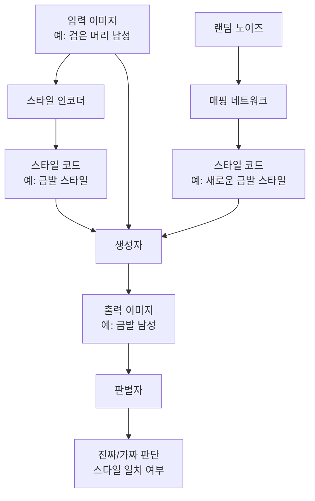
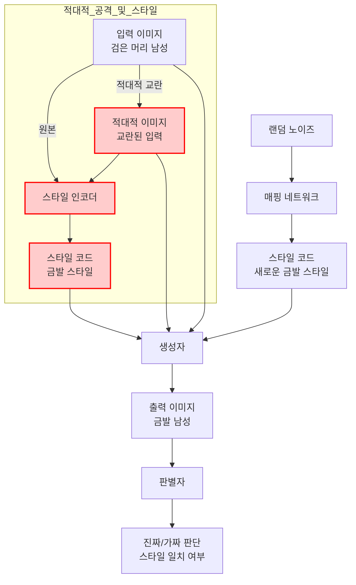
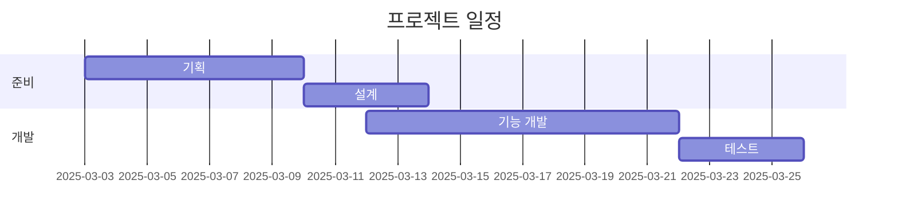
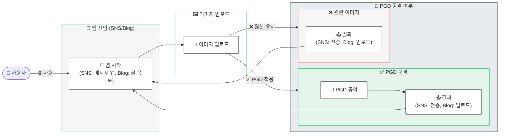
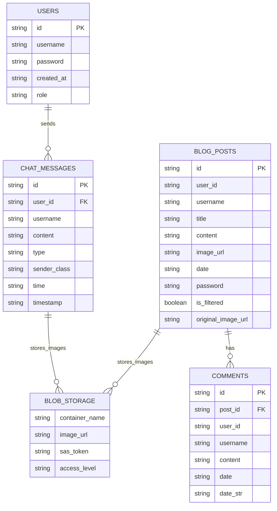

# **AIFAKER**
__PGD 기반 적대적 노이즈를 활용한 딥페이크 방지 필터__

---
## 1. 소개

### 개요
[코드 깃허브](https://github.com/hyundairotemai2/AIFAKER/blob/main/AIFAKER.ipynb)

[웹페이지](https://aifaker-a7c9ehd0bzbxfpcy.koreasouth-01.azurewebsites.net/)

[프레젠테이션](https://www.canva.com/design/DAGim4xNjVM/OS5Z3hfUzYSrRb0oreUEyw/edit?utm_content=DAGim4xNjVM&utm_campaign=designshare&utm_medium=link2&utm_source=sharebutton)

## 2. 연구 배경 및 필요성

### 딥페이크 범죄 사례

__딥페이크만 검색하더라도 관련 범죄에 대해 뉴스가 많다. -> 딥페이크를 방지하는 방법이 없을까?__

여기에 대한 해결책을 중심으로 연구를 시작하였고 딥페이크 관련 공개된 자료와 그에 대응하는 모델을 연구하게 되었다.
비즈니스 모델을 적용하여 눈으로 탐지하기 어렵지만 딥페이크 학습을 방해하는 모델을 웹서비스로 구현하는 것을 목표로 하였다. 

## 3. 이론 배경
### 딥페이크 및 StarGANv2

<li>GAN(생성적 적대 신경망)을 기반으로 한 이미지 변환 모델</li>

- StarGAN v2의 핵심 기능은 다중 도메인 이미지 변환 ex) 사람 얼굴을 "금발 여성 스타일", "고양이 얼굴 스타일" 등으로 바꾸는 작업.
- 기본 GAN은 단순히 가짜 이미지를 만드는 데 초점이 맞춰져 있다면, StarGAN 시리즈는 이미지 간 변환에 특화
<li>StarGAN v2작동방식</li>

- **StarGANv2를 딥페이크에 사용하는 이유** 

  -얼굴 스타일을 자유롭게 바꿀 수 있어서 딥페이크 제작에 활용됨   
  -최신 이미지 변환 모델 중 하나라, 딥페이크 방지 기술을 테스트하기에 적합한 강력한 상대                                                                              
  -다양한 스타일을 다룰 수 있고, 결과가 자연스러워서 실제 딥페이크 시나리오를 시뮬레이션하기 좋음
         
### PGD ( 적대적 노이즈 기법 )  

- PGD의 정의
 
  -PGD(Projected Gradient Descent)는 적대적 공격 기법으로, 입력 이미지에 작은 노이즈를 반복적으로 추가하여 모델을 속이거나 성능을 저하시키는 방법
  
  -경사 하강법을 사용하며, 교란 크기를 epsilon 범위로 제한

- PGD 모델의 작동 방식
 
  -초기 노이즈 추가 후, 손실 함수의 경사를 계산

  -경사 방향으로 교란을 업데이트하고, epsilon 내로 투영

  -지정된 반복 횟수(num_iter) 동안 최적화

- PGD의 장점

  -강력함: 단일 단계 공격보다 효과적인 교란 생성

  -조정 가능: epsilon, alpha로 교란 강도 제어

  -유연성: LPIPS, MSE 등 다양한 손실 함수 결합 가능

  -안정성: 반복적 최적화로 신뢰할 수 있는 결과 제공

- 딥페이크 대응 모델로 PGD를 선택한 이유

  -FGSM같은 단일단계공격보다 더 정교한 반복적 접근법 사용. 여러 번에 걸쳐서 노이즈를 조금씩 조정하면서 모델이 인식하지 못할 정도로 미세하지만, 최대한 효과적인 방향으로 데이터를 변형

  -PGD는 수학적으로 안정적이고 이론적 기반이 탄탄

## 4. 필터 구현 및 결과

### PGD 적용 Before/After

  

    
<strong>Before</strong>

    
  

  

    
<strong>After</strong>

    
  

- **Before**: 적대적 노이즈 적용 전
- **After**: 적대적 노이즈 적용 후 결과

__이미지에 미세한 조정을 하여 사람 눈으로 차이를 바로 알아보기 어렵다.__

### StarGANv2 딥페이크 테스트 결과

## 5. 프로젝트 일정 및 개발 흐름

## 6. 웹 애플리케이션

### 전체 아키텍처

### SNS/블로그 사용자 흐름도

## 7. 웹 백엔드 구성

### 핵심 기술 스택

> Flask 기반 웹 애플리케이션 + 노이즈 모델 + 프론트엔드 통합 프로젝트  
> GitHub Actions를 활용한 CI/CD와 Azure 배포까지 전 과정 포함

### 🗂️ CI/CD 파이프라인

### 데이터베이스 아키텍처

### 시연 자료 링크

## 8. 한계점 및 향후 개선 방향
  - 공개된 딥페이크 자료가 부족해서 딥페이크의 다양한 모델에 대한 테스트를 진행하지 못함

    __모델들의 연구를 더 진행하여 추가 필터 적용 예정__
  
  - PGD 기법을 활용해 StarGANv2 딥페이크를 방해하는 필터를 완성하였으나 웹서버에 V2 사전학습 데이터는 이식하지 못함 (현재 웹서버에 적용된 필터는 프로토 타입 모델)
  
    __사전학습 데이터를 웹 서버에 추가하여 더 자연스러운 필터를 구현할 예정__ 
