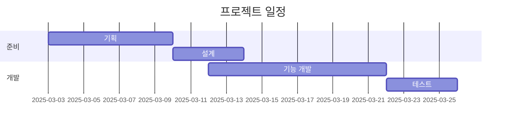
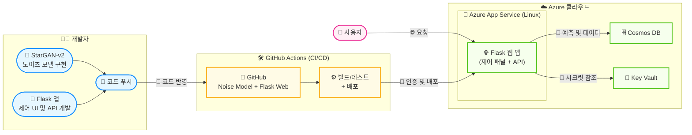
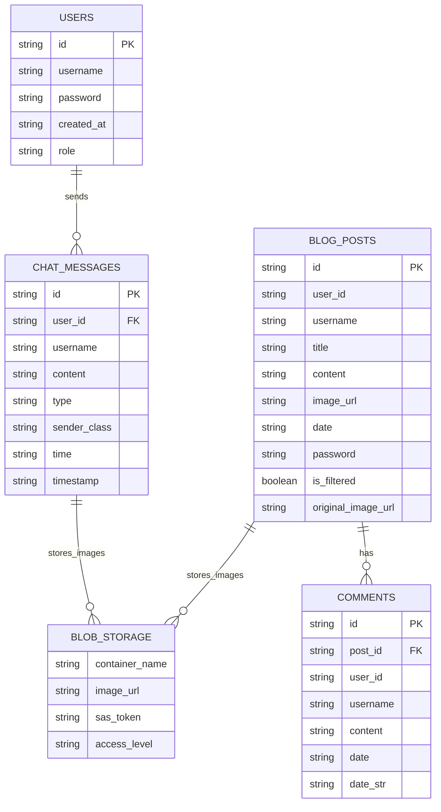

# **AIFAKER**

[코드 깃허브](https://github.com/hyundairotemai2/AIFAKER/blob/main/AIFAKER.ipynb)

[웹페이지](https://aifaker-a7c9ehd0bzbxfpcy.koreasouth-01.azurewebsites.net/)

[프레젠테이션](https://www.canva.com/design/DAGim4xNjVM/OS5Z3hfUzYSrRb0oreUEyw/edit?utm_content=DAGim4xNjVM&utm_campaign=designshare&utm_medium=link2&utm_source=sharebutton)

# 🔧 프로젝트 스택

> Flask 기반 웹 애플리케이션 + 노이즈 모델 + 프론트엔드 통합 프로젝트  
> GitHub Actions를 활용한 CI/CD와 Azure 배포까지 전 과정 포함

---

## 📅 프로젝트 일정

## 🗂️ 시스템 아키텍처

##  데이터베이스 아키텍처

##  노이즈 단계별 이미지 검증 결과

